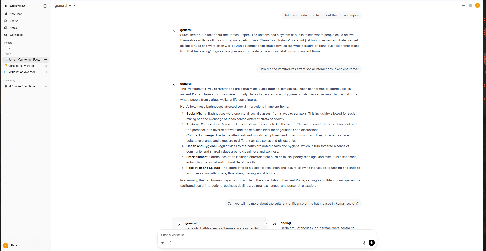
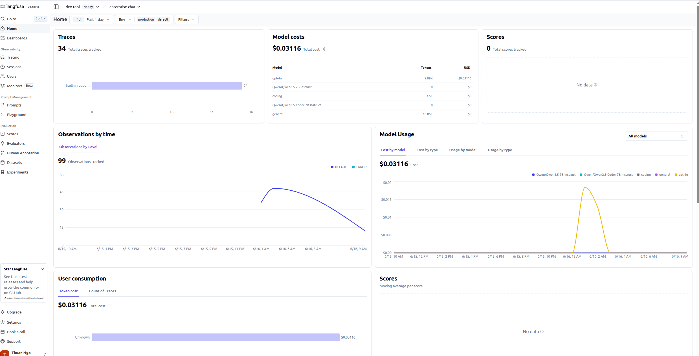
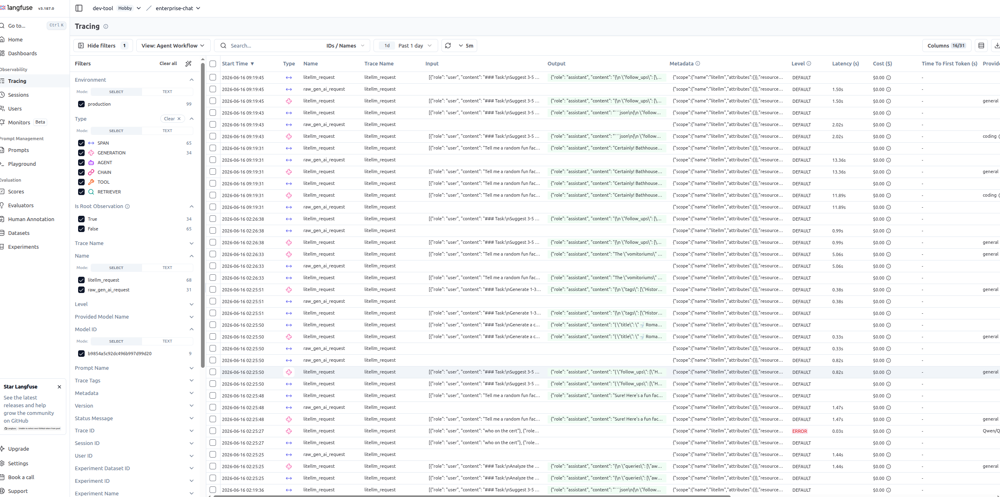

# Enterprise ChatGPT

[](LICENSE)

A self-hosted, enterprise-grade ChatGPT alternative that runs local LLMs via vLLM, exposes them through a unified LiteLLM gateway, and serves them with an Open WebUI frontend. Optionally integrates with cloud models (OpenAI, Anthropic) and traces all LLM calls through Langfuse.

## Screenshots

### Open WebUI — Chat Interface


### Langfuse — LLM Observability Dashboard



## Architecture

```
Browser
  └── Open WebUI (port 3000)
        └── LiteLLM Proxy (port 4000)
              ├── vLLM - General (Qwen2.5-7B-Instruct)     (port 8000)
              ├── vLLM - Coder  (Qwen2.5-Coder-7B-Instruct)(port 8001)
              ├── OpenAI GPT-4o            (external)
              └── Anthropic Claude 3.5     (external)

Supporting services:
  PostgreSQL (port 5432)  — LiteLLM metadata & analytics DB
  Redis      (port 6379)  — optional caching
  Langfuse                — LLM observability (external / self-hosted)
```

## Models

| Name | Backend | Description |
|------|---------|-------------|
| `general` | Qwen/Qwen2.5-7B-Instruct | General-purpose chat |
| `coding` | Qwen/Qwen2.5-Coder-7B-Instruct | Code generation & completion |
| `fast` | Qwen/Qwen2.5-7B-Instruct | Low-latency alias |
| `fallback` | Qwen/Qwen2.5-7B-Instruct | Fallback routing target |
| `gpt-4o` | OpenAI API | Requires `OPENAI_API_KEY` |
| `claude-3-5-sonnet` | Anthropic API | Requires `ANTHROPIC_API_KEY` |

## Prerequisites

- Docker & Docker Compose
- NVIDIA GPU with drivers + [nvidia-container-toolkit](https://docs.nvidia.com/datacenter/cloud-native/container-toolkit/install-guide.html)
- Sufficient VRAM (recommended: 16 GB+ for both vLLM instances combined)

## Getting Started

### 1. Configure environment

```bash
cd infra/docker
cp .env.example .env
# Edit .env — set LITELLM_MASTER_KEY, HF_TOKEN (if using gated models),
# and optionally OPENAI_API_KEY / ANTHROPIC_API_KEY
```

### 2. Create data directories

```bash
bash infra/docker/scripts/init.sh
```

### 3. Start the stack

```bash
cd infra/docker
docker compose up -d
```

Services start in dependency order: PostgreSQL → vLLM instances → LiteLLM → Open WebUI.

### 4. Access

| Service | URL |
|---------|-----|
| Open WebUI | http://localhost:3000 |
| LiteLLM API | http://localhost:4000 |
| LiteLLM UI | http://localhost:4000/ui |

## Configuration

### Environment variables (`infra/docker/.env`)

| Variable | Description |
|----------|-------------|
| `LITELLM_MASTER_KEY` | API key for all LiteLLM requests |
| `QWEN_MODEL` | HuggingFace model ID for the general vLLM instance |
| `QWEN_CODER_MODEL` | HuggingFace model ID for the coder vLLM instance |
| `HF_TOKEN` | HuggingFace token (required for gated models) |
| `OPENAI_API_KEY` | Optional — enables `gpt-4o` model |
| `ANTHROPIC_API_KEY` | Optional — enables `claude-3-5-sonnet` model |
| `LANGFUSE_PUBLIC_KEY` | Langfuse project public key |
| `LANGFUSE_SECRET_KEY` | Langfuse project secret key |
| `LANGFUSE_HOST` | Langfuse endpoint (e.g. `https://us.cloud.langfuse.com`) |
| `POSTGRES_*` | PostgreSQL credentials for LiteLLM |

### Adding or changing models

Edit [litellm/config.yaml](litellm/config.yaml). Each entry under `model_list` maps a friendly name to a backend. Restart the `litellm` container to apply changes:

```bash
docker compose restart litellm
```

## Testing

Verify the stack with the bundled demo script:

```bash
bash demo/test_models.sh
```

This hits the LiteLLM `/v1/models` endpoint and sends a test completion request to the `general` model.

Or call the API directly:

```bash
curl http://localhost:4000/v1/chat/completions \
  -H "Content-Type: application/json" \
  -H "Authorization: Bearer <LITELLM_MASTER_KEY>" \
  -d '{"model": "coding", "messages": [{"role": "user", "content": "Write a Python quicksort"}]}'
```

## Observability

LiteLLM is configured to emit traces to Langfuse via OpenTelemetry (`langfuse_otel` callback). Set `LANGFUSE_*` variables in `.env` to enable it. Traces include model, latency, token counts, and cost estimates.

To disable tracing, comment out the `callbacks` line in [litellm/config.yaml](litellm/config.yaml).

## Project Structure

```
enterprise-chatgpt/
├── infra/
│   └── docker/
│       ├── docker-compose.yml   # Service definitions
│       ├── .env.example         # Environment template
│       └── scripts/
│           ├── init.sh          # Create data directories
│           └── healthcheck.sh
├── litellm/
│   └── config.yaml              # Model routing config
├── demo/
│   └── test_models.sh           # Quick smoke test
└── data/                        # Runtime data (gitignored)
    ├── models/                  # HuggingFace model cache
    └── open-webui/              # Open WebUI database & uploads
```
